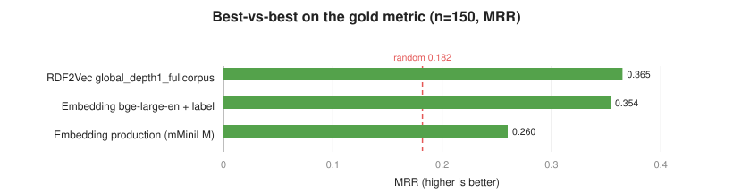
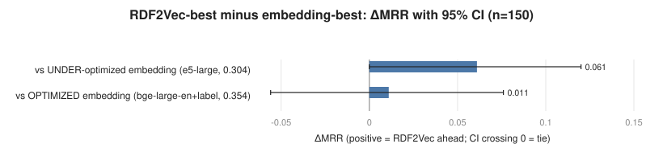

= RDF2Vec vs Sentence-Embedding Substitute Ranking: Best-vs-Best on the Gold Metric
:toc:
:toclevels: 3
:sectnums:

_Combines the two optimization studies: `rdf2vec-optimizations/CONCLUSION.adoc` and `embedding-optimizations/CONCLUSION.adoc`. Both were run on the same evaluation sets with byte-identical metric code, so their best configurations are directly comparable here._

[abstract]
DynBench ranks candidate entity substitutes; two methods compete — RDF2Vec graph embeddings and sentence embeddings. Each was optimized in its own study on the same gold-based ranking metric (MRR of the gold substitute over 150 items). Taken at their *best* parameters, the two methods are a *statistical tie*: optimized RDF2Vec (`global_depth1_fullcorpus`, MRR 0.365) versus optimized embedding (`bge-large-en-v1.5` on the entity label, MRR 0.354) differ by only ΔMRR +0.011 (95% CI [−0.056, +0.076], P=0.63), i.e. indistinguishable. This tie only appears once *both* methods are optimized: against an under-optimized embedding ranker (MRR 0.304) RDF2Vec was borderline-significantly ahead (+0.061, P=0.98). The gold metric structurally favors same-type/popularity matching, so it cannot crown an absolute winner on substitute *quality*; on the metric it measures, the two are even. Deployment factors therefore decide, and they favor the embedding method (live-robust, no global catalog), with a hybrid as the upside.

== What is being compared

Both methods rank the same recall pool of same-type candidates for each item and are scored by where the *gold substitute* (the entity DynBench actually swapped in) lands. The two optimization studies each searched their method's parameter space:

* *RDF2Vec* (`rdf2vec-optimizations/`): the winner is one global Word2Vec model over depth-1 graph walks. Optimizing it more than doubled the production configuration (≈ random) — the original "RDF2Vec is weak" result was a misconfiguration.
* *Embedding* (`embedding-optimizations/`): the winner is a strong English retrieval model (`bge-large-en-v1.5`) fed the entity *label only*. Optimizing it significantly beat the production multilingual-MiniLM setting (+0.094 MRR).

Because the metric code is shared byte-for-byte and the items are identical, a paired comparison of the two winners is valid.

== Best-vs-best result

[options="header"]
|===
| Method (best configuration) | n=150 MRR | Hits@5 | Hits@10
| RDF2Vec — `global_depth1_fullcorpus` (global model, depth-1 walks) | 0.365 | 0.51 | 0.74
| Embedding — `bge-large-en-v1.5` + label-only text | 0.354 | 0.49 | 0.68
| Embedding — production (mMiniLM + "label, description") | 0.260 | 0.31 | 0.55
| RDF2Vec — production (per-request, depth-2, 4 walks) | 0.200 | 0.30 | 0.53
| random baseline | 0.182 | — | —
|===

The two optimized methods are within one hundredth of an MRR point of each other, and far above either production setting.

== The tie depends on optimizing both sides

The paired bootstrap (per-item reciprocal rank, B = 10,000, same 150 items) shows the comparison is *sensitive to how well the embedding method is optimized*:

[options="header"]
|===
| Contrast (n=150) | ΔMRR [95% CI] | P(Δ>0) | verdict
| RDF2Vec-best vs *under-optimized* embedding (e5-large, 0.304) | +0.061 [+0.000, +0.120] | 0.98 | borderline RDF2Vec ahead
| RDF2Vec-best vs *optimized* embedding (bge-large-en+label, 0.354) | +0.011 [−0.056, +0.076] | 0.63 | *tie*
|===

Had the embedding method been left at a reasonable-but-unoptimized operating point, this comparison would have reported RDF2Vec as the better ranker. The extended embedding search closed that gap entirely. The methodological point: a method comparison is only as fair as the *weakest-optimized* side, and small differences (here ≈ 0.05 MRR) hinge on it.

== What the gold metric can and cannot say

The verdict above is strictly *on the gold metric*, whose limits are carried over from both studies:

* *It favors structural matching by construction.* The gold substitutes were generated as same-type, similar-popularity swaps. RDF2Vec's depth-1 graph signal encodes exactly that, and a strong text encoder recovers it from the entity name. So the metric measures _structural / identity_ suitability, not full _semantic_ appropriateness. A tie here means the two methods are equally good at recovering the kind of substitute DynBench already makes — not that they are equally good in every sense.
* *It is even-handed between the methods.* Both are scored on identical items and candidate sets with identical code, so as a _relative_ instrument the comparison is fair, even though it cannot crown an absolute winner on substitute quality.
* *Coverage was separated from ranking.* The gold was injected when retrieval missed it, so these numbers reflect ranking ability, not recall.

== Deployment dimensions (where the methods differ)

On the gold metric the methods tie, so practical factors decide. These are not symmetric:

[options="header"]
|===
| Dimension | RDF2Vec (optimized) | Embedding (optimized)
| Live coverage (original n=1,000 run) | 52% (graph-walk timeouts on big entities) | 90%
| Offline coverage (this study) | ≈ 92% | ≈ 92%
| Infrastructure | needs a precomputed *global* model / catalog | none — encode on the fly
| Failure mode | live walk-extraction timeouts against the endpoint | none observed
| Cost | graph crawl + Word2Vec training | one forward pass per text (heavier model on CPU)
|===

The optimized RDF2Vec ranker requires a global model trained over a candidate catalog, and in the live setting it suffered walk-extraction timeouts that cut its coverage to 52%. The embedding ranker needs no catalog, ran at 90% live coverage, and has no comparable failure mode.

== Recommendation

* *Keep the sentence-embedding method as the production default.* It ties optimized RDF2Vec on ranking quality and is materially better on coverage and operational simplicity. Adopt the optimized configuration: a strong English retrieval model (`bge-large-en-v1.5`, or `bge-m3`/`distiluse` if multilingual entity text must be supported) fed the entity *label*, with cosine similarity and no prompt — a significant +0.094 MRR over the current multilingual-MiniLM + "label, description" setting.
* *Do not dismiss RDF2Vec as a ranker.* Properly configured (one global model, depth-1 walks) it matches the embedding method on the gold metric; its disadvantage is operational, not in ranking quality.
* *Consider a hybrid.* The two methods optimize complementary signals (graph structure vs entity-name text) and tie on average, which suggests they disagree on individual items; an ensemble (embedding for coverage and recall, a global depth-1 RDF2Vec re-rank where the graph is available) is the natural next experiment.

== Appendix

Numbers are from `rdf2vec-optimizations/results_n150/` and `embedding-optimizations/results_n150/` (150 items; RDF2Vec averaged over 5 seeds, embedding deterministic). The paired bootstrap uses each item's mean reciprocal rank. Live-coverage figures are from the earlier descriptive n=1,000 three-way comparison. Figures are dependency-free SVG from `embedding-optimizations/_make_charts.py`.
