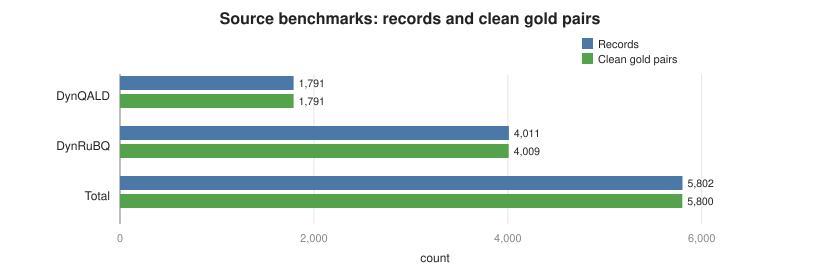
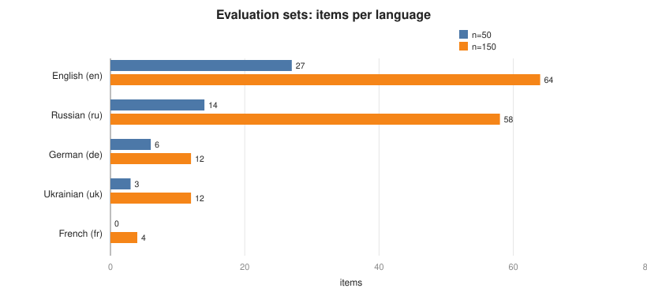
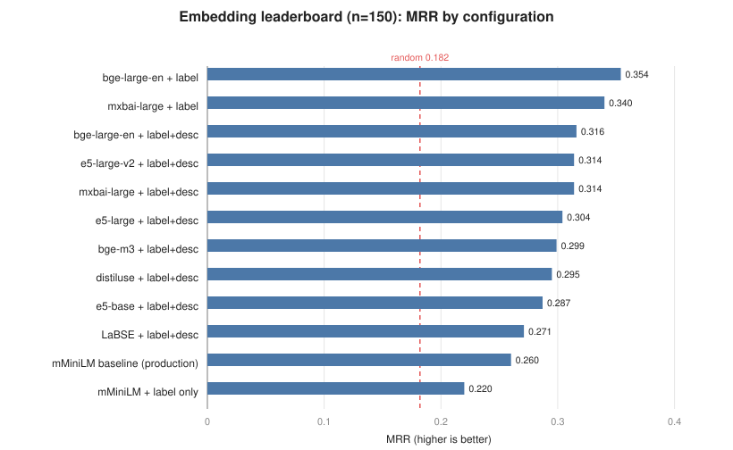
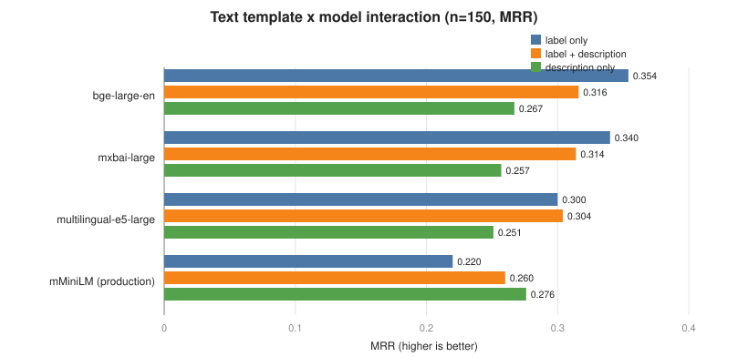
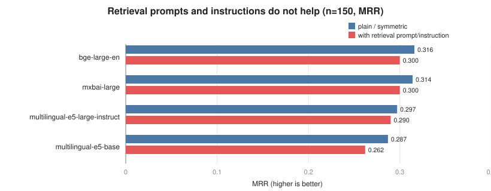
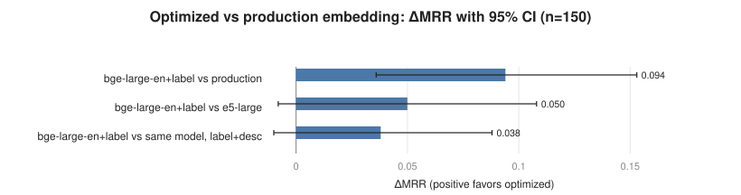
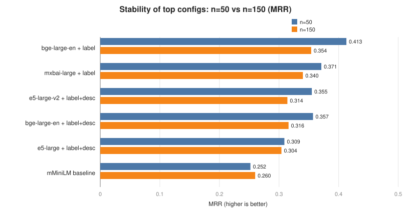

= Optimizing the Sentence-Embedding Substitute Ranker
:toc:
:toclevels: 3
:sectnums:
:source-highlighter: rouge

_Companion to `../rdf2vec-optimizations/CONCLUSION.adoc`. This study optimizes the parameters of the sentence-embedding substitute ranker and is built to be directly comparable to the RDF2Vec study (same evaluation sets, same metric, same result schema). The best-vs-best comparison of the two methods is in `../CROSS-METHOD-COMPARISON.adoc`._

[abstract]
The sentence-embedding method is the live-robust substitute ranker in DynBench, but it had only ever been run at one operating point (multilingual MiniLM over "label, description" text). We search its parameter space — 14 models, text templates, similarity/normalization, and instruction prompts; 45 configurations over evaluation sets of 50 and 150 items — to find the best-possible embedding ranker and to make the comparison with optimized RDF2Vec fair. A first, narrow sweep suggested the method was insensitive to its parameters and that the production model was already near-optimal. Extending the search overturned that: a strong English retrieval model (`bge-large-en-v1.5`) fed the entity *label only* reaches MRR 0.354 at n=150, a significant +0.094 over the production baseline (paired bootstrap P=1.00). The decisive lever is a *text-template × model interaction* — strong English models rank best on the entity name alone, while the weaker multilingual baseline needs the description. Similarity metric and retrieval prompts do not help. The improvement matters beyond this study: it raises optimized embedding to a statistical tie with optimized RDF2Vec on the gold metric (see the cross-method report), where the under-optimized embedding had trailed.

== Context and problem

DynBench substitutes an entity in a benchmark question with a same-kind entity, which requires *ranking* a recall pool of same-type candidates so the most suitable substitute is on top. Of the three rankers compared earlier, the sentence-embedding method was the live-robust winner (90% coverage against the public endpoint, no global catalog required), and it is the production default. But it had been evaluated at a single operating point: the `paraphrase-multilingual-MiniLM-L12-v2` model encoding "label, description" text with cosine similarity.

Two questions follow. First, *what are the embedding method's optimal parameters* — model, input text, similarity, prompts? Second, because the companion study showed RDF2Vec was merely misconfigured rather than weak, *a fair method comparison requires both methods at their best*; an embedding ranker left at an arbitrary operating point would bias that comparison.

*Problem statement.* Search the embedding method's parameter space on the same gold-based ranking metric used for RDF2Vec, find the best-possible configuration, and quantify how much parameterization matters.

== Hypotheses

The null hypothesis (*H0*) is that _the production embedding configuration is already near-optimal — no reasonable configuration significantly improves it_. Against it we test four mechanism hypotheses:

H1 (model):: A stronger or differently-trained sentence-transformer ranks substitutes better than the multilingual MiniLM baseline.
H2 (text template):: The text fed to the model matters — entity label, description, or combinations rank differently.
H3 (similarity / normalization):: The scoring geometry matters — cosine (L2-normalized dot) versus un-normalized dot versus euclidean distance.
H4 (prompt / instruction):: Retrieval-style query/passage prefixes or task instructions (for E5, BGE, mxbai) improve ranking.

== Dataset

The evaluation data is *identical* to the RDF2Vec study — the same gold `(original entity → gold substitute)` pairs and the same candidate pools — so the two studies are directly comparable. The one difference in what is *used*: the embedding method consumes only the candidates' *label and description text*; it does not use the materialized Wikidata graph that RDF2Vec walks.

=== Source benchmarks and the gold signal

Each `DynQALD`/`DynRuBQ` record stores an original `query` and a perturbed `new query` that differ in exactly one entity — the gold substitute. A record contributes a clean pair if and only if exactly one `wd:Q…` entity is removed and one added. The benchmarks are multilingual (English, Russian, German, Ukrainian, French).

[options="header"]
|===
| Source benchmark | Records | Clean single-entity gold pairs
| `DynQALD.json` | 1,791 | 1,791 (100%)
| `DynRuBQ.json` | 4,011 | 4,009 (99.95%)
| *Total* | *5,802* | *5,800*
|===

=== Evaluation sets

From the 5,800 gold pairs we draw two evaluation sets (fixed seed 42, first _N_ records with a distinct original entity and a usable candidate pool, `pool_limit=50`). The candidate text fed to the embedder is each entity's English label and description. When retrieval misses the gold it is injected, so ranking is measured independently of retrieval coverage.

[options="header"]
|===
| Property | n = 50 | n = 150
| Eval items (distinct originals) | 50 | 150
| Languages | en 27, ru 14, de 6, uk 3 | en 64, ru 58, de 12, uk 12, fr 4
| Candidates / item — mean (median) | 25.9 (19) | 27.6 (19)
| Gold naturally retrieved into pool | 14 / 50 (28%) | 39 / 150 (26%)
| Gold injected (missed by retrieval) | 36 | 111
|===

== Methods

*Task.* For each item, rank its candidate set by cosine similarity (or the configured metric) of the chosen text representation to the original entity, and record the rank of the gold substitute.

*Metrics.* Hits@k (k = 1, 3, 5, 10), mean reciprocal rank (MRR), and coverage, each reported next to an analytic random-ranking baseline on the identical candidate sets.

*Why MRR is the suitable primary metric.* The task has exactly one gold target per item and is consulted top-down: DynBench needs one good substitute at or near the top of the ranked list, not a fully ordered list. Mean reciprocal rank is the canonical metric for this single-relevant-item setting — it scores each item by the reciprocal of the gold's rank, so it is dominated by the top positions (rank 1 → 1.0, rank 2 → 0.5, rank 10 → 0.1) and rewards exactly the behavior we care about. It is a bounded, interpretable per-item scalar (in [0, 1], 1 meaning "always first") that, because reciprocal rank normalizes for list length, is comparable across items whose candidate sets differ in size. Hits@k is reported as a threshold-specific complement.

*Comparability proof.* The metric code (`eval_common.py`) is copied byte-for-byte from the RDF2Vec harness, and the baseline configuration (`mMiniLM`, "label, description", cosine, no prefix) reproduces the RDF2Vec study's `embedding_reference` exactly — identical per-item gold ranks. The two studies therefore score on the same scale.

*Configuration grid.* 45 configurations: a 14-model sweep (multilingual MiniLM/MPNet/distiluse/LaBSE, English MiniLM/MPNet/mxbai/BGE-large, multilingual E5 small/base/large/large-instruct, English E5-large-v2, BGE-m3) at "label, description"; a `{label, description}` template grid on the strong models; the full template sweep on the baseline model; similarity variants (cosine, un-normalized dot, euclidean); and prompt/instruction ablations.

*Statistics.* Embedding inference is deterministic, so each configuration is a single repeat. We report MRR with a 95% bootstrap CI over items (B = 10,000) and use a paired bootstrap over per-item reciprocal rank for decisive contrasts.

== Results

=== Leaderboard

[options="header"]
|===
| Configuration | n=150 MRR | n=150 Hits@5 | n=150 Hits@10
| *bge-large-en + label only* | *0.354* | 0.49 | 0.68
| *mxbai-large + label only* | *0.340* | 0.49 | 0.66
| bge-large-en + label+description | 0.316 | 0.48 | 0.65
| e5-large-v2 + label+description | 0.314 | 0.47 | 0.61
| mxbai-large + label+description | 0.314 | 0.47 | 0.65
| multilingual-e5-large + label+description | 0.304 | 0.41 | 0.62
| bge-m3 + label+description | 0.299 | 0.46 | 0.63
| distiluse + label+description | 0.295 | 0.41 | 0.59
| mMiniLM baseline (production) | 0.260 | 0.31 | 0.55
| mMiniLM + label only | 0.220 | 0.29 | 0.47
| random baseline | 0.182 | — | —
|===

The best configuration is `bge-large-en-v1.5` fed the entity *label only*, at MRR 0.354 — well above the production baseline (0.260) and the rest of the field, which clusters in 0.27–0.32.

=== The decisive lever: a text-template × model interaction

[options="header"]
|===
| Model | label only | label + description | description only
| bge-large-en | *0.354* | 0.316 | 0.267
| mxbai-large | *0.340* | 0.314 | 0.257
| multilingual-e5-large | 0.300 | 0.304 | 0.251
| mMiniLM (production) | 0.220 | 0.260 | *0.276*
|===

Template choice is the dominant lever, and it *interacts with the model*. Strong English retrieval models rank best on the entity *name alone*: adding the description hurts them (bge-large-en: 0.354 → 0.316 → 0.267). The weaker multilingual baseline is the opposite — it needs the description and is worst on the label alone (mMiniLM: 0.276 description, 0.260 label+description, 0.220 label only). The interpretation: a strong English encoder already captures an entity's type and identity from its name (which is what a same-kind substitute shares), and the free-text description adds noise; a weaker multilingual encoder cannot, and leans on the description for signal.

=== Levers that do not help

*Retrieval prompts and instructions hurt or do nothing.* The substitute task is symmetric (entity vs entity), not query-vs-passage, so retrieval prompts are a mismatch.

[options="header"]
|===
| Model | plain / symmetric | with retrieval prompt or instruction
| bge-large-en | 0.316 | 0.300
| mxbai-large | 0.314 | 0.300
| multilingual-e5-large-instruct | 0.297 | 0.290
| multilingual-e5-base | 0.287 (query:/query:) | 0.262 (query:/passage:)
|===

*Similarity / normalization is a minor lever.* For the (internally normalized) E5 models, cosine, un-normalized dot, and euclidean give identical rankings (e5-large: 0.304 for all three). For the baseline model the spread is small: dot 0.264, cosine 0.260, euclidean 0.242. Cosine is a safe default; euclidean is marginally worse.

=== Significance and stability

The best configuration significantly beats the production baseline; individual model swaps at the default template do not — it is the model *and* the label-only template *together* that win.

[options="header"]
|===
| Contrast (n=150, paired bootstrap) | ΔMRR [95% CI] | P(Δ>0) | verdict
| bge-large-en+label vs production | +0.094 [+0.036, +0.153] | 1.00 | *significant*
| bge-large-en+label vs e5-large (prev. best) | +0.050 [−0.008, +0.108] | 0.96 | n.s.
| bge-large-en+label vs same model, label+desc | +0.038 [−0.010, +0.088] | 0.94 | n.s.
| e5-large vs production (model swap only) | +0.044 [−0.007, +0.096] | 0.95 | n.s.
|===

The ranking is stable across sample sizes — the top configurations are the English/E5 models on the label at both n=50 and n=150, though the small-sample n=50 values run optimistically high.

== Discussion

*The first, narrow sweep was misleading.* A 25-configuration sweep (the original 9 models plus a few templates) found everything clustered in 0.24–0.30 and no significant winner, suggesting H0 — that the method is insensitive and production is near-optimal. *Extending the search rejected H0:* adding strong English retrieval models and the label-only template found `bge-large-en + label` at 0.354, +0.094 over production with P=1.00. The lesson is methodological — "the method is insensitive to its parameters" can be an artifact of an incomplete search; the genuinely best operating point lived in a corner (a strong English model on the name alone) that the narrow sweep never visited.

*Hypothesis outcomes.* *H2 (template)* is supported and decisive, via the model interaction above. *H1 (model)* is supported only in combination: a stronger model at the default template gives a non-significant gain (e5-large +0.044, P=0.95), but the same upgrade with label-only text is significant. *H3 (similarity)* and *H4 (prompts)* are rejected.

*Carry-over caveat for the cross-method comparison.* As in the RDF2Vec study, the gold metric rewards same-type, similar-popularity matching — the way the gold substitutes were generated. It measures _structural/identity_ suitability, not full _semantic_ appropriateness, so it cannot crown an absolute production winner. It is, however, an even-handed yardstick *between* the two methods because both are scored on the identical items and candidate sets. With the embedding method now properly optimized, that comparison is a statistical tie (preview: ΔMRR +0.011, P=0.63; full analysis in `../CROSS-METHOD-COMPARISON.adoc`).

== Conclusion and recommendations

*Optimal embedding configuration:*

[source]
----
model       = BAAI/bge-large-en-v1.5     (or mixedbread-ai/mxbai-embed-large-v1)
text        = entity LABEL only          (not "label, description")
similarity  = cosine
prompt      = none                        (no query/passage or instruction prefix)
----

This reaches MRR 0.354 at n=150, a significant +0.094 over the production `mMiniLM` + "label, description" setting. The single most important change is the *text template*: feed a strong English encoder the entity name alone.

*Practical notes for DynBench.* The win requires a *strong* English model; on the existing multilingual MiniLM, switching to label-only is the *worst* choice (0.220), so the template change must accompany the model change. If multilingual robustness on non-English entity text is required in production, `bge-m3` (0.299) or `distiluse` (0.295) are multilingual options that still beat the current baseline, though by less. Similarity metric and prompts can be left at cosine / none.

== Appendix — reproducibility and compute

All numbers are from `results/` (n=50) and `results_n150/` (n=150), one deterministic repeat per configuration. The baseline reproduces the RDF2Vec `embedding_reference` exactly. The sweep runs one worker per model (each loads its model once) over 14 models on CPU; encoding the heavy 1,024-dimensional models (bge-large-en, mxbai, e5-large family, bge-m3, LaBSE) dominates the runtime. Figures are dependency-free SVG generated by `_make_charts.py`.
