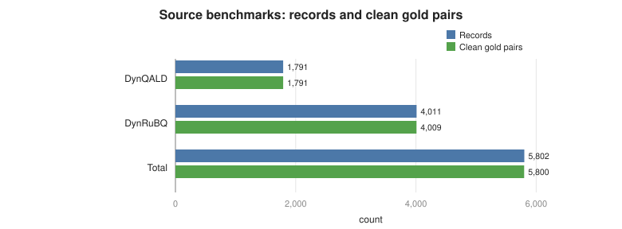
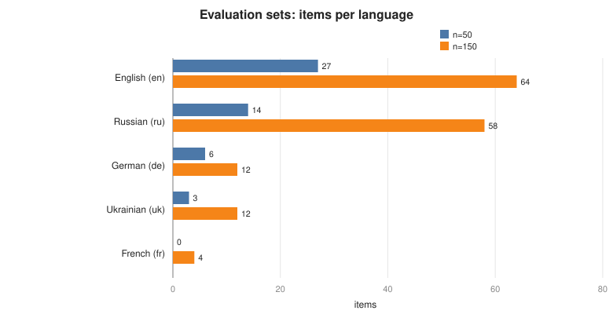
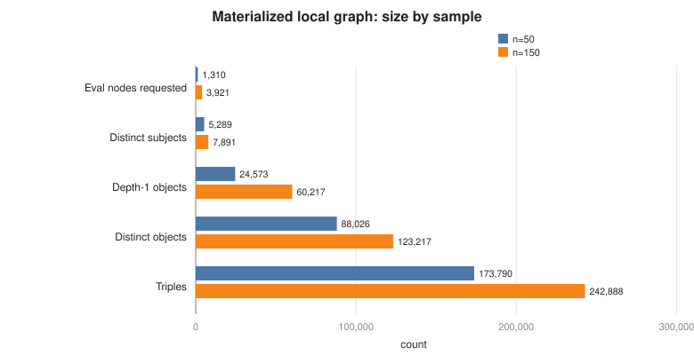
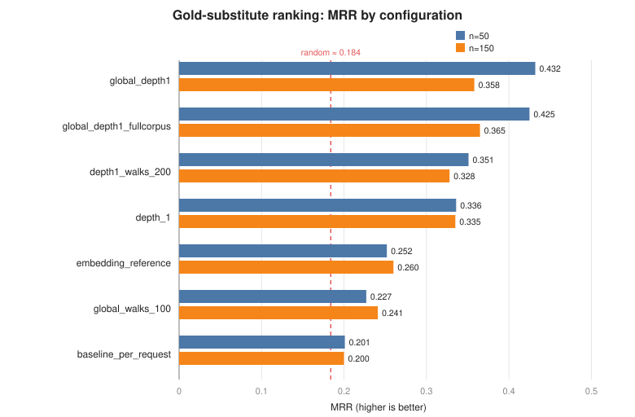
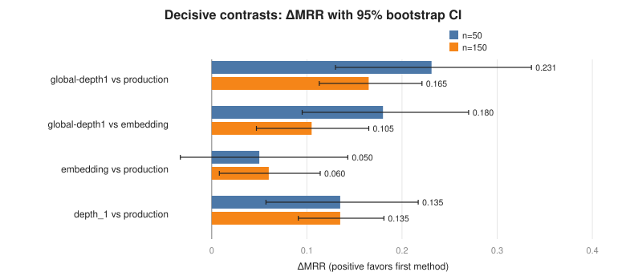

= Is RDF2Vec Unsuitable for Entity-Substitute Search, or Merely Misconfigured?
:toc:
:toclevels: 3
:sectnums:
:source-highlighter: rouge

_Final report of the RDF2Vec parameter-optimization study. Companion documents: `README.md` (methodology and soundness safeguards) and `strategy-0*.md` (one report per lever tested)._

[abstract]
In DynBench's substitute-search comparison, RDF2Vec was the weakest of three candidate-ranking methods. We test whether that is an inherent limitation or an artifact of how RDF2Vec was configured, using a gold-based ranking metric derived from the DynQALD and DynRuBQ benchmarks. Sweeping 31 RDF2Vec configurations plus a sentence-embedding reference over evaluation sets of 50 and 150 items (5 stochastic repeats each, offline on a materialized Wikidata sub-graph), we find that the production configuration ranks at the random baseline (MRR ≈ 0.20), but two corrections — walk depth 2→1 and one global model instead of a fresh per-request one — together roughly double it (MRR 0.36–0.43) and make RDF2Vec significantly outperform both the production setting and the sentence-embedding reference on the gold metric (paired bootstrap P ≥ 0.99). The result is stable across both sample sizes. We conclude that RDF2Vec was *badly under-configured, not inherently inferior*, while being explicit that the gold metric structurally favors RDF2Vec and therefore corrects the record rather than crowning an absolute winner.

== Context and problem

DynBench perturbs benchmark questions by substituting an entity in the query with a same-kind entity (e.g. _Finland → Estonia_), then re-deriving the answer. The quality of these perturbations depends on a *candidate-ranking* step: given an original entity and a recall pool of same-type candidates, rank the candidates so the most suitable substitute is on top.

An earlier three-way comparison (n=1,000, live Wikidata) evaluated three rankers — relaxed-SPARQL, sentence-embedding, and RDF2Vec. *RDF2Vec was the weakest*: 52% coverage, lowest top-similarity, slowest. Before concluding that RDF2Vec is unsuitable for this task, two confounds must be ruled out:

. *Was it used correctly?* RDF2Vec was run with a specific, possibly poor configuration (a fresh model trained per request on a tiny corpus, `max_depth=2`, `max_walks=4`). A method evaluated at one bad operating point says nothing about the method.
. *Was the coverage problem about ranking at all?* About 93% of RDF2Vec's empty results in the live run were ≥15 s walk-extraction _timeouts against the public endpoint_ — a deployment problem, not a ranking-quality problem.

*Problem statement.* Determine whether _any reasonable parameterization_ of RDF2Vec, evaluated offline (no endpoint timeouts) on a ground-truth ranking metric, is competitive with the established sentence-embedding method — and if so, which configuration.

== Hypotheses

The overarching null hypothesis (*H0*) is that _no reasonable RDF2Vec configuration approaches the sentence-embedding reference_ — i.e. RDF2Vec is inherently inferior for this task. Against it we test five mechanism hypotheses, one per tunable lever:

H1 (walk budget, `strategy-01`):: The neighborhood is under-sampled; more and/or deeper walks help. Varies `max_walks` (4→200) and `max_depth` (1→4).
H2 (Word2Vec hyperparameters, `strategy-02`):: The Word2Vec training is the bottleneck. Varies vector size, epochs, window, and skip-gram vs CBOW.
H3 (training corpus, `strategy-03`, _central_):: The tiny *per-request* corpus is the core flaw; one *global* model helps. Compares per-request vs global vs whole-graph corpus.
H4 (walker, `strategy-04`):: A structure-aware walker captures "same kind" better. Compares Random / Weisfeiler-Lehman / HALK / NGram / Walklet.
H5 (sampler, `strategy-05`):: Biasing walks toward informative edges helps. Compares uniform / PageRank / object-frequency / wide.

== Dataset

=== Source benchmarks and the gold signal

The evaluation exploits a ground-truth signal already present in DynBench's outputs: each record stores both the original `query` and the perturbed `new query`, which differ in exactly one entity — the *gold substitute* the original DynBench process chose for that item. Diffing the two SPARQL queries yields a clean `(original entity → gold substitute)` pair. A record contributes a clean pair if and only if exactly one `wd:Q…` entity is removed and exactly one added between `query` and `new query` (multi-entity edits are excluded). The benchmarks are multilingual (QALD and RuBQ provenance): English, Russian, German, Ukrainian, and a few French questions.

[options="header"]
|===
| Source benchmark | Records | Clean single-entity gold pairs
| `DynQALD.json` | 1,791 | 1,791 (100%)
| `DynRuBQ.json` | 4,011 | 4,009 (99.95%)
| *Total* | *5,802* | *5,800*
|===

=== Evaluation sets

From the 5,800 gold pairs we draw two evaluation sets by shuffling with a fixed seed (42) and taking the first _N_ records that (a) introduce a *distinct* original entity and (b) yield a usable candidate pool. For each item we record the original entity, the gold substitute, the *candidate pool* (the same recall set the production rankers see, `pool_limit=50`), and label/description text for ranking.

[options="header"]
|===
| Property | n = 50 (`data/`) | n = 150 (`data_n150/`)
| Eval items (distinct originals) | 50 | 150
| Languages | en 27, ru 14, de 6, uk 3 | en 64, ru 58, de 12, uk 12, fr 4
| Candidates / item — mean (median) | 25.9 (19) | 27.6 (19)
| Candidates / item — min / max | 3 / 91 | 1 / 97
| Gold naturally retrieved into pool | 14 / 50 (28%) | 39 / 150 (26%)
| Gold injected (missed by retrieval) | 36 | 111
|===

The gold lands in the recall pool only about 26–28% of the time — a property of _retrieval_, shared by all rankers. To measure *ranking* independently of retrieval coverage, when the gold is missing it is *injected* into the candidate set (and the natural-retrieval rate is reported separately, above). The n=150 set is a larger-scale replication (3× the items, more Russian and a little French) used to confirm that findings are not an artifact of the small n=50 sample.

=== Materialized local knowledge graph

To remove the live-endpoint timeout confound, the Wikidata "truthy" entity sub-graph is materialized *once* and every configuration is then run offline against it (no network, no timeouts, reproducible). Scope: for every evaluation node (originals, golds, candidates), all `wdt:` edges whose object is a Wikidata entity (literal-valued statements dropped, so walks capture structural/type similarity); depth-1 for all eval nodes plus a bounded depth-2 expansion of their object entities (the shared types and neighbors that create cross-candidate similarity; bounds `D1_LIMIT=500`, `D2_LIMIT=200`, `MAX_D2=4000`). The graph is stored as N-Triples (`local_graph.nt`), read by pyRDF2Vec's `KG` via rdflib.

[options="header"]
|===
| Local graph | n = 50 | n = 150
| Eval nodes requested (originals ∪ golds ∪ candidates) | 1,310 | 3,921
| Distinct subjects | 5,289 | 7,891
| Distinct objects | 88,026 | 123,217
| Triples | 173,790 | 242,888
| Depth | 2 | 2
| Unique depth-1 objects | 24,573 | 60,217
|===

== Methods

*Task.* For each item, rank its candidate set by cosine similarity of the chosen representation to the original entity, and record the *rank of the gold substitute*.

*Metrics.* Hits@k (k = 1, 3, 5, 10), mean reciprocal rank (MRR), mean/median gold rank, and coverage (fraction of items with a usable ranking). For RDF2Vec, the representation is the graph-walk Word2Vec vector of the entity URI; for the reference, the sentence embedding of the entity's "label, description" text (`paraphrase-multilingual-MiniLM-L12-v2`).

*Why MRR is the suitable primary metric.* The task has exactly one gold target per item and is consulted top-down: DynBench needs one good substitute at or near the top of the ranked candidate list, not a fully ordered list. Mean reciprocal rank is the canonical metric for this single-relevant-item retrieval setting — it scores each item by the reciprocal of the gold's rank, so it is dominated by the top positions (rank 1 → 1.0, rank 2 → 0.5, rank 10 → 0.1) and rewards exactly the behavior we care about: pushing the gold to the top. It yields one bounded, interpretable scalar per item (in [0, 1], where 1 means "always ranked first") that averages stably over items, and because reciprocal rank normalizes for list length it is comparable across items whose candidate sets differ in size (here 1–97 candidates). Hits@k, reported alongside, is a useful threshold-specific complement (does the gold fall in the top _k_?) but discards rank information within and beyond _k_, whereas MRR integrates over all ranks. We therefore use MRR as the primary metric and Hits@k as supporting detail.

*Calibration.* Absolute gold-rank numbers are _not_ read on their own (see the Discussion). Every RDF2Vec configuration is reported next to (a) an analytic *random-ranking baseline* on the identical candidate sets and (b) the *sentence-embedding reference*. The question is strictly relative.

*Configuration grid.* 31 RDF2Vec configurations spanning the five levers above, plus the embedding reference (32 total). RDF2Vec defaults follow the production code (vector size 100, epochs 10, sg=1, window 5, RandomWalker, uniform sampler).

*Statistics.* 5 stochastic repeats per configuration (seeds 0–4); we report MRR mean ± std across repeats and a 95% bootstrap CI over items (B = 10,000) using each item's mean reciprocal rank across repeats. Decisive contrasts use a *paired bootstrap* over per-item mean reciprocal rank.

*Reproducibility.* Determinism is pinned end-to-end: `workers=1`, subsampling off, CRC32 Word2Vec hash, and a fixed interpreter hash seed (`PYTHONHASHSEED=0`, self-pinned by `run_experiment.py`). The process-parallel runner produces *bit-identical* results to sequential execution.

== Results

=== Leaderboard

MRR (mean ± std over 5 repeats); ranking identical at both sample sizes.

[options="header"]
|===
| Config | Mode | n=50 MRR | n=150 MRR | n=150 Hits@5 | n=150 Hits@10
| `global_depth1` | global, depth 1 | *0.432* | *0.358* | 0.50 | 0.76
| `global_depth1_fullcorpus` | global (whole graph), depth 1 | *0.425* | *0.365* | 0.51 | 0.74
| `depth1_walks_200` | per-request, depth 1 | 0.351 | 0.328 | 0.48 | 0.67
| `depth_1` | per-request, depth 1 | 0.336 | 0.335 | 0.54 | 0.71
| `embedding_reference` | sentence embedding | 0.252 | 0.260 | 0.31 | 0.55
| `global_walks_100` | global, depth 2 | 0.227 | 0.241 | 0.37 | 0.60
| `baseline_per_request` (production) | per-request, depth 2, 4 walks | 0.201 | 0.200 | 0.30 | 0.53
| random baseline | — | 0.185 | 0.183 | — | —
|===

=== Decisive contrasts (paired bootstrap, per-item mean reciprocal rank)

[options="header"]
|===
| Comparison | n=50 ΔMRR [95% CI] | n=150 ΔMRR [95% CI] | Verdict
| best global-depth1 vs production | +0.231 [+0.130, +0.336], P=1.00 | +0.165 [+0.113, +0.221], P=1.00 | *significant*
| best global-depth1 vs embedding | +0.180 [+0.095, +0.270], P=1.00 | +0.105 [+0.047, +0.165], P=1.00 | *significant*
| embedding vs production | +0.050 [−0.033, +0.143], P=0.87 | +0.060 [+0.008, +0.114], P=0.99 | n.s. → marginal
| `depth_1` vs production | +0.135 [+0.057, +0.217], P=1.00 | +0.135 [+0.091, +0.181], P=1.00 | *significant*
|===

Effect sizes are roughly 20–30× the run-to-run standard deviation (≈ 0.007–0.03).

=== Lever-by-lever findings (hypothesis outcomes)

* *H1 — walk depth: SUPPORTED, and the dominant lever.* Dropping `max_depth` 2→1 at fixed walks lifts MRR by +0.135 (P=1.00); going _deeper_ hurts (depth 3 ≈ 0.200, depth 4 ≈ 0.190 ≈ random). The "same-kind" signal lives in the *direct* neighborhood (P31 type, country, …); depth ≥2 dilutes it with neighbors-of-neighbors shared across the whole class. The production `depth=2` was the single biggest mistake. The number of walks is a weak secondary lever (≈50–100 suffice once depth is right).
* *H3 — training corpus: SUPPORTED, decisive in combination.* Global training helps only modestly alone at depth 2 (+0.03–0.04), but *global + depth-1 reaches 0.432*, far above per-request depth-1 (0.336). The per-request corpus (~20–50 entities) is far too small for Word2Vec; a few thousand entities suffice — training on the _whole_ graph adds nothing over the eval-set corpus (0.425 vs 0.432). Global models are also more stable.
* *H2 — Word2Vec hyperparameters: REJECTED.* Vector size, epochs, window and CBOW all stay in a tight 0.21–0.225 band, within one standard deviation of the base; none approaches depth-1. If the input walks lack the signal, embedder tuning cannot recover it.
* *H4 — walker: REJECTED.* Weisfeiler-Lehman / HALK / NGram / Walklet all fall in 0.209–0.246, overlapping plain RandomWalker within noise.
* *H5 — sampler: REJECTED (minor).* uniform / wide / PageRank / object-frequency move things only within noise; PageRank adds the most _variance_ for no mean gain.

Notably, the *most expensive* configurations were among the worst: `walker_wl` (0.221–0.246, ~5.3 h/repeat at n=150), `global_full_corpus_deep` (0.223–0.224), and `combined_best` (0.223–0.236). Compute did not buy quality — a clean negative result. *H0 is rejected:* a reasonable RDF2Vec configuration not only approaches but exceeds the embedding reference on the gold metric.

== Discussion — what this does and does NOT establish

The gold is a *single, popularity-matched* substitute (the one DynBench happened to choose), so the metric is a noisy, conservative lower bound, read only relative to the random baseline and the embedding reference. Two threats to validity bound the interpretation:

* *The metric is favorable to RDF2Vec by construction.* The gold substitutes were generated as _same-type, similar-popularity_ swaps, and that is exactly the structural/type/popularity signal RDF2Vec's depth-1 walks encode. So "global-depth1 beats embedding on this metric" does *not* establish that RDF2Vec picks more _semantically appropriate_ substitutes. The embedding method optimizes a different (textual label/description) notion of similarity; the two are *complementary*, and this metric cannot crown an absolute production winner.
* *Retrieval vs ranking are separated deliberately.* The gold is naturally retrieved only about 26–28% of the time; injecting it isolates ranking from retrieval coverage. Offline coverage is about 0.99 for every configuration — confirming that the original ~52% live coverage was endpoint walk-extraction timeouts, not ranking failure. The embedder implementation itself is correct (clean-graph sanity check, `README.md` §2.4).

*What the study establishes soundly:* RDF2Vec is *not inherently inferior* for substitute ranking. The original "RDF2Vec is weak" result was a *misconfiguration* (per-request / depth-2 / 4-walks ≈ random), confirmed at two independent sample sizes under pinned-seed reproducibility.

== Conclusion and recommendations

*Verdict.* RDF2Vec was badly under-configured, not unsuitable. Fixing two production mistakes — train *one global model* and walk at *`max_depth=1`* — moves it from the random baseline to the top of the gold-metric leaderboard, above the sentence-embedding reference.

*Recommended RDF2Vec configuration* (if `SUBSTITUTE_METHOD=rdf2vec` is used):

[source]
----
one global Word2Vec model (not per-request)
max_depth   = 1
max_walks   ≈ 100         # 50 is nearly as good; >100 adds nothing
walker      = RandomWalker (default)
sampler     = uniform (default)
Word2Vec    = defaults: vector_size=100, epochs ≈ 10–50, sg=1, window=5
----

*Practical implication for DynBench.*

* For *live* substitute generation the *sentence-embedding method remains the practical default*: it was the robust winner of the n=1,000 live comparison (90% coverage, no global catalog required), whereas RDF2Vec-global needs a precomputed model and suffered live walk-extraction timeouts.
* This study *corrects the record*: as a _ranker on the structural gold metric_, properly-configured RDF2Vec (global, depth-1) is competitive with — and on this metric better than — the embedding method. If RDF2Vec is used, it *must* be global + depth-1, never the production per-request / depth-2 / 4-walks.
* *Future work:* a *hybrid* — embedding (text) for recall/coverage, global depth-1 RDF2Vec for a structural re-rank — is the natural next step, since the two optimize complementary signals.

== Appendix — reproducibility and compute

All numbers are from `results/` (n=50) and `results_n150/` (n=150), 5 stochastic repeats each, fully reproducible. `run_experiment.py` self-pins `PYTHONHASHSEED=0` (hash salting otherwise changes set-iteration order during walk extraction → different walks → different per-item ranks; aggregate MRR is stable to three decimals but per-item ranks are not). Each repeat trains single-threaded (`workers=1`, CRC32 hashfxn); the `--jobs` process-parallel runner is *bit-identical* to sequential and was used to run the full 32-configuration sweeps across 16 cores (n=150 total compute ≈ 87 h, wall-collapsed onto the cores).
